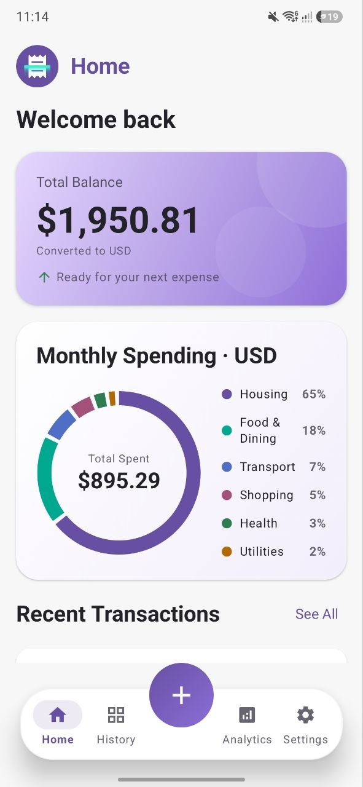
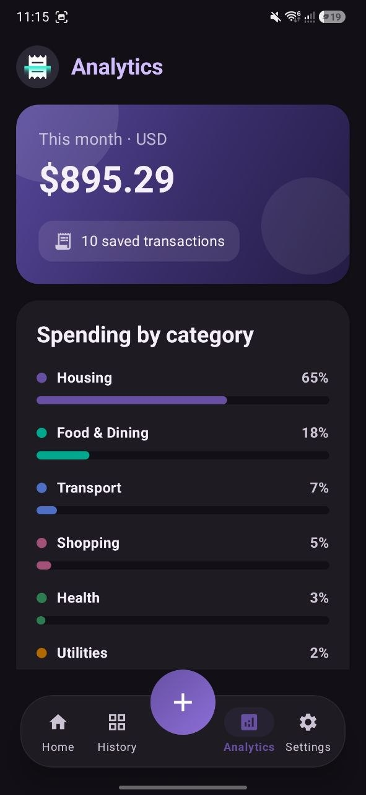
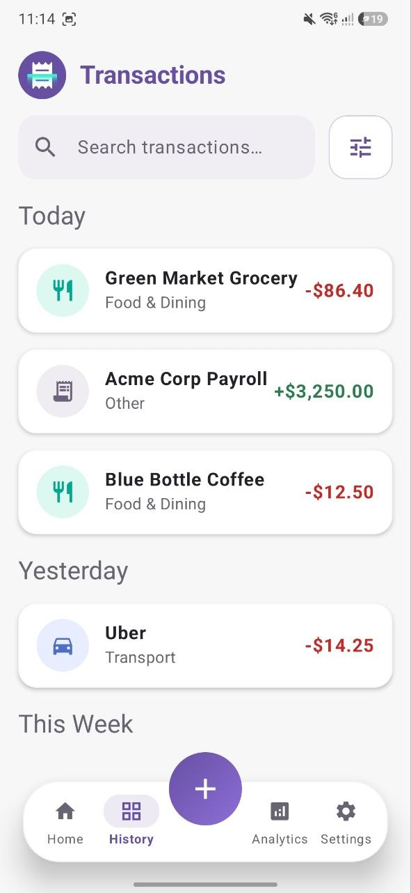
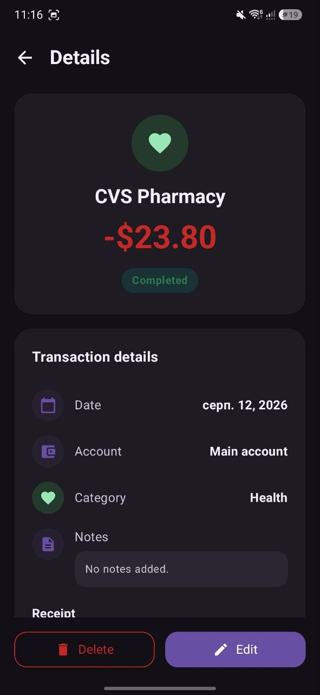
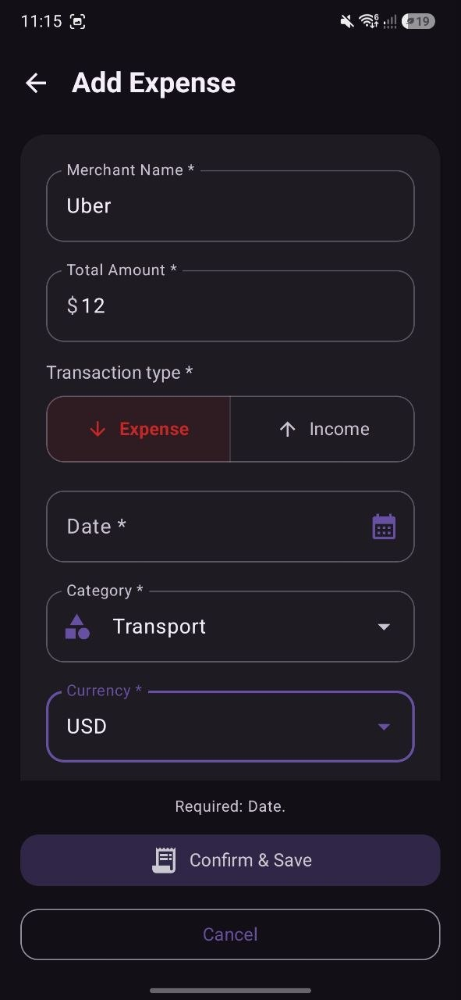

# ReceiptAI — Expense & Budget Tracker


ReceiptAI is a modern, offline-first Android app for personal finance management. It combines classic expense tracking with a polished, animated Material 3 experience and an AI receipt scanner — all data stays on the device.

## Screenshots

<p align="center">
  
  
  
</p>
<p align="center">
  
  
</p>

## Features

**AI Receipt Scanner**
- ML Kit Document Scanner (on-device via Google Play Services): auto-detects receipt edges, crops, and perspective-corrects
- A provider-agnostic AI layer extracts merchant name, total amount, currency, date, and category with a strict JSON-only prompt
- The scanned receipt photo is attached to the transaction and viewable full-screen in the details screen
- Works offline too: without a connection the photo is still attached, and details can be entered manually
- Graceful degradation at every step: unreadable receipts and unavailable models open a manual form with a friendly message

**AI pipeline**

```
Receipt photo (ML Kit, cropped JPEG)
        │
        ▼
GeminiReceiptParser (primary, Google AI SDK)
        │  gemini-flash-lite-latest    ── 2 attempts, 20s timeout, 0.8s backoff
        │  gemini-flash-latest         ── same, tried if the model above fails
        │  gemini-3.1-flash-lite       ── last Gemini reserve
        ▼  (all failed?)
NvidiaReceiptParser (fallback, NVIDIA NIM API)
        │  nvidia/nemotron-3-nano-omni-30b-a3b-reasoning
        │  temperature 0.2 · top_p 0.95 · thinking disabled · non-streaming
        ▼
ScannedReceipt JSON ──► pre-filled Add Transaction form
```

Both providers share one prompt and one response parser (`ScannedReceiptJson`), so behavior stays identical regardless of which model answers. Requests are compressed to ≤1600px JPEG before upload.

> **Note:** during prototyping the AI providers are accessed directly from the app, so the API keys are embedded in the APK. For a production deployment, API access should be moved behind a secure backend proxy (e.g. Firebase Cloud Functions with Secret Manager).

**Dashboard & Analytics**
- Total balance and current-month spending overview with animated donut chart
- Spending breakdown by category with percentages
- Recent transactions timeline
- Dedicated analytics screen with monthly insights and transaction counts

**Transaction Management (CRUD)**
- Add, edit, and delete expenses and income
- Search and filter transaction history by type and time range
- Automatic grouping by day (Today / Yesterday / This Week / Older)
- Multi-currency input with offline reference conversion rates

**Security**
- App Lock with a 4-digit PIN (stored as a salted PBKDF2 hash, never in plaintext)
- Biometric unlock (fingerprint / face) via AndroidX BiometricPrompt, with PIN fallback
- Re-lock after 5 minutes in background, always on cold start
- CSV export neutralizes spreadsheet formula injection

**Customization**
- Light / dark / system theme with dedicated night launch theme
- Display currency selection (USD, EUR, GBP, PLN, CAD, AUD, JPY)
- Five languages: English, Ukrainian, Polish, German, Spanish — with Android 13+ per-app language support

## Tech Stack

| Area | Technology |
| --- | --- |
| Language | Kotlin |
| UI | Jetpack Compose, Material 3, custom theming with design tokens |
| Architecture | Clean Architecture, MVI (Unidirectional Data Flow) |
| Persistence | Room (SQLite), Preferences DataStore |
| DI | Hilt |
| Async | Coroutines & Flow |
| Security | AndroidX Biometric, PBKDF2WithHmacSHA256 |
| AI & Scanning | ML Kit Document Scanner, Gemini API (primary), NVIDIA NIM with Nemotron (fallback), kotlinx.serialization |
| Infrastructure | Firebase: Crashlytics crash reporting, google-services integration |
| Build | Gradle (Kotlin DSL), R8 minification + resource shrinking |

## Architecture

The app follows Clean Architecture with a strict dependency rule: `presentation → domain ← data`. Presentation never touches data implementations directly; everything flows through domain interfaces bound by Hilt.

```
app/src/main/java/com/receiptai/tracker/
├── MainActivity.kt              # Composition root: theming, locale, lock gate
├── ReceiptAIApplication.kt      # Hilt application entry point
├── di/                          # Hilt modules (database, repositories)
├── domain/
│   ├── model/                   # Expense, AppSettings, ScannedReceipt — pure models
│   ├── repository/              # ExpenseRepository, SettingsRepository, ReceiptParser, ReceiptImageStore
│   ├── money/                   # CurrencyConverter (minor units, BigDecimal)
│   └── security/                # PinHasher (salted PBKDF2)
├── data/
│   ├── ai/                      # Receipt parsing: Gemini chain, NVIDIA fallback, shared prompt
│   ├── local/                   # Room database, DAO, entity, migrations
│   ├── net/                     # ConnectivityChecker
│   ├── receipts/                # ReceiptImageStoreImpl (JPEG files)
│   ├── repository/              # ExpenseRepositoryImpl
│   └── settings/                # SettingsRepositoryImpl (DataStore + legacy migration)
├── presentation/
│   ├── MainViewModel.kt         # App-level state: settings, lock lifecycle
│   ├── dashboard/               # Home screen, MVI state/intents, ViewModel
│   ├── expense/                 # Add/edit transaction flow
│   ├── history/                 # Transaction history, details, filters
│   ├── analytics/               # Monthly analytics screen
│   ├── settings/                # Settings, PIN management, CSV export
│   ├── lock/                    # Lock screen, PIN pad, biometric prompt
│   ├── localization/            # Typed string-resources facade (5 locales)
│   ├── navigation/              # Bottom bar, section headers
│   └── components/              # Shared UI: dialogs, formatters, receipt viewer
└── ui/theme/                    # Colors, gradients, typography, day/night tokens
```

**Key design decisions**

- **MVI state flow** — each screen exposes a single immutable `UiState` plus a sealed `Intent` hierarchy; state changes are pure functions of the previous state, and UI events travel one way only.
- **Money as minor units** — amounts are persisted as `Long` minor units (cents) and converted with `BigDecimal`, so no floating-point drift is possible.
- **Offline-first currency conversion** — deterministic reference rates power display conversion without network access; a remote rate provider can replace the converter without touching persistence or UI.
- **Hashed PIN at rest** — the PIN never leaves the device and is stored only as `PBKDF2WithHmacSHA256(password, random salt, 60k iterations)`; the DataStore file is excluded from cloud backups and device transfers.
- **Scanner-first AI flow** — ML Kit returns a cropped JPEG, and a provider-agnostic `ReceiptParser` abstraction runs a Gemini model chain with retries/timeouts, automatically falling back to NVIDIA Nemotron when Google is overloaded; parsing failures degrade gracefully to a manual form.
- **Non-destructive Room migrations** — schema changes ship with explicit migrations; schemas are exported under `app/schemas/` for diff validation.

## Getting Started

**Requirements:** Android Studio (Ladybug or newer), JDK 11+, Android SDK with compileSdk 36.

The AI receipt parser expects API keys in `local.properties` (git-ignored; injected via `BuildConfig` at build time):

```properties
GEMINI_API_KEY=your_gemini_key        # from https://aistudio.google.com
NVIDIA_API_KEY=your_nvidia_key        # optional fallback, from https://build.nvidia.com
```

A missing `NVIDIA_API_KEY` simply disables the fallback provider — the Gemini chain keeps working.

```bash
git clone <repository-url>
cd ReceiptAIExpenseBudgetTracker

./gradlew :app:assembleDebug          # debug build
./gradlew :app:testDebugUnitTest      # unit tests
./gradlew :app:lintDebug              # lint
./gradlew :app:assembleRelease        # R8-minified release (debug-signed for local testing)
```

Min SDK 24 (Android 7.0) · Target SDK 36 (Android 16).

## Testing

The app ships with JVM unit tests covering the core business logic — no emulator required:

| Test | What it verifies |
| --- | --- |
| `CurrencyConverterTest` | Cross-currency conversion of minor units via BigDecimal, JPY zero-decimal handling |
| `CategoryPercentageTest` | Category shares always sum to exactly 100% (largest-remainder rounding) |
| `TransactionAmountSignTest` | Expense/income signing of amounts into persisted minor units |
| `TransactionTypeTest` | Transaction type switching keeps the entered amount intact |
| `AmountParserTest` | Lenient parsing of user-entered amounts (`14.50`, `14,50`, edge inputs) |
| `MoneyFormatterTest` | Display formatting of minor units across currencies |
| `ExpenseCsvFormatterTest` | CSV escaping of commas/quotes and formula-injection neutralization |
| `CategoryVisualsTest` | Stable category-to-color/icon mapping |
| `ThemeModeTest` | Theme storage-value round-trip and unknown-value fallback |

```bash
./gradlew :app:testDebugUnitTest
```

## Data & Privacy

- All data lives locally: Room database for transactions, Preferences DataStore for settings, app-internal storage for receipt photos.
- Receipt images are sent to the configured AI provider (Google or NVIDIA) solely for extraction; nothing else leaves the device.
- Crashlytics reports anonymous crash diagnostics to Firebase to improve stability; no personal or financial data is ever sent.
- CSV export writes only to a user-chosen location via the system file picker.
- "Delete All Data" removes every stored transaction, receipt photo, and setting permanently.
- The PIN-bearing settings file is excluded from Android cloud backup and device-to-device transfer.

## License

All rights reserved.
